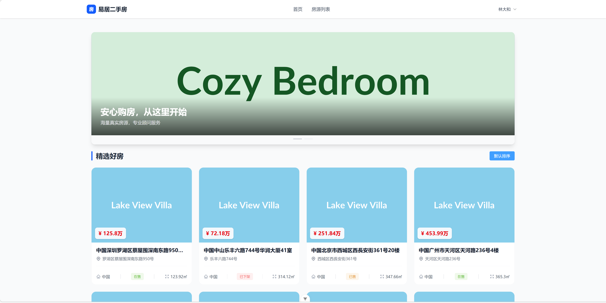
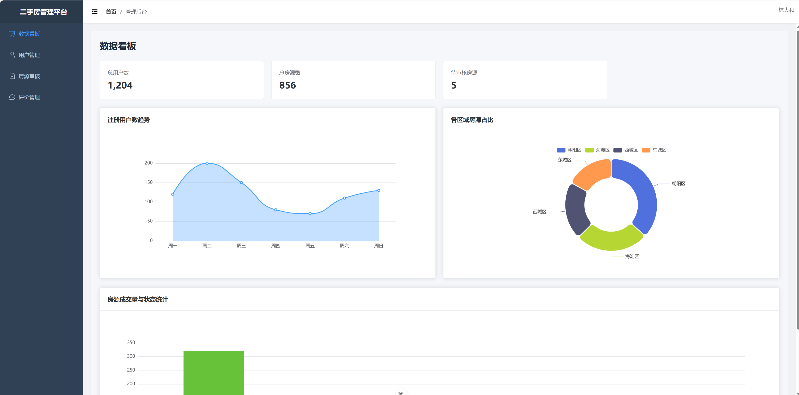
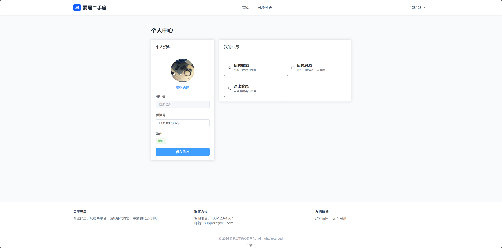

# 🏠 二手房信息交易平台 - 后端服务 (Backend)

|  |  |  |
| :----------------------------------------------------------: | :----------------------------------------------------------: | :----------------------------------------------------------: |
|                           房源首页                           |                          管理员后台                          |                           个人中心                           |

本项目是一个基于现代化全栈技术的二手房信息交易平台的后端核心服务。旨在解决传统房产交易中信息不对称、流程繁琐的问题，提供高并发、高性能的房源数据处理与业务逻辑服务。


## 1. 项目概览

| 属性 | 信息 |
| :--- | :--- |
| **项目名称** | Second-Hand Housing Trading Platform |
| **开发语言** | Python 3.9+ |
| **后端框架** | FastAPI |
| **数据库** | MySQL 8.0 |
| **数据持久层** | SQLAlchemy (ORM) |
| **异步任务** | AsyncIO (原生支持) |
| **授权协议** | MIT |

## 2. 技术架构与选型

本系统严格遵循 **前后端分离** 架构设计，后端专注于数据处理与业务逻辑。

*   **FastAPI**: 利用其异步非阻塞（Async/Await）特性处理高并发房源查询，结合 Pydantic 实现严格的数据校验。
*   **JWT (JSON Web Token)**: 实现无状态的用户身份认证与权限分级控制（RBAC）。
*   **RESTful API**: 遵循标准的 RESTful 风格设计接口，确保接口的可读性与可维护性。
*   **SQLAlchemy**: 作为对象关系映射（ORM）工具，将 Python 对象与数据库表进行映射。
*   **Pydantic**: 用于数据解析、校验和设置管理，保证数据交互的安全性。

## 3. 核心功能模块

后端业务逻辑层主要包含以下核心模块：

*   **🔐 认证与权限管理**: 支持用户注册、登录（JWT签发）、个人信息管理；实现多角色（购房者、房东、管理员）的权限隔离。
*   **🏠 房源核心服务**: 
    *   **发布**: 支持房源基础信息录入与多图异步上传。
    *   **检索**: 提供多维度动态筛选（区域、价格、户型）与关键词模糊搜索。
    *   **审核**: 实现“发布-审核-上架”的业务流转机制。
*   **💬 互动与评价**: 支持房源收藏（幂等性设计）、用户评价打分及评论管理。
*   **📊 数据可视化 (Admin)**: 提供房源成交量、用户增长趋势、区域分布等聚合统计接口。

## 4. 开发环境与依赖

### 4.1 环境要求
*   Python >= 3.9
*   MySQL 8.0+
*   Node.js (仅用于开发环境对比，后端主要依赖Python)

### 4.2 依赖安装
```bash
# 推荐使用虚拟环境
python -m venv venv
source venv/bin/activate # Linux/Mac
# 或 venv\Scripts\activate # Windows

# 安装依赖
pip install -r requirements.txt